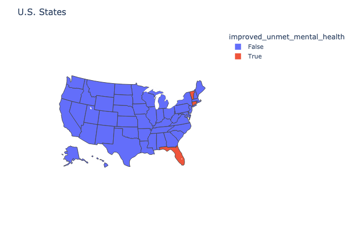
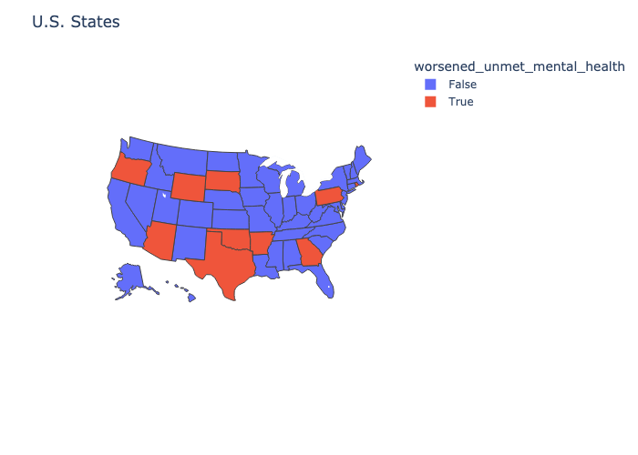
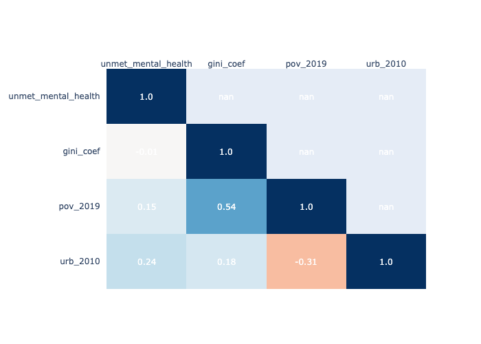
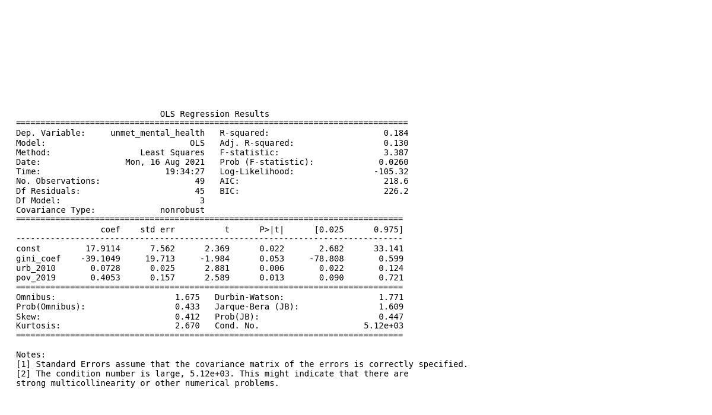
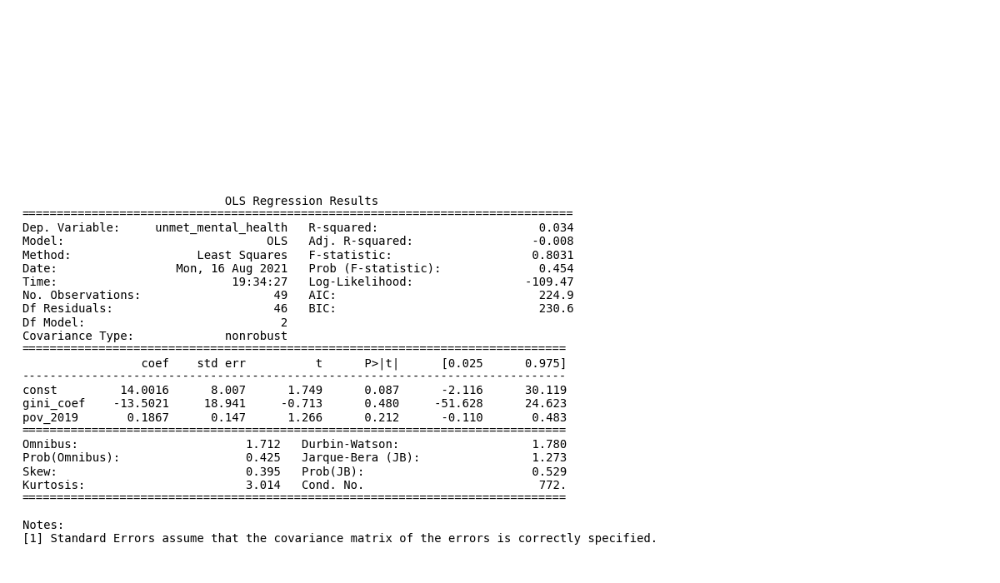
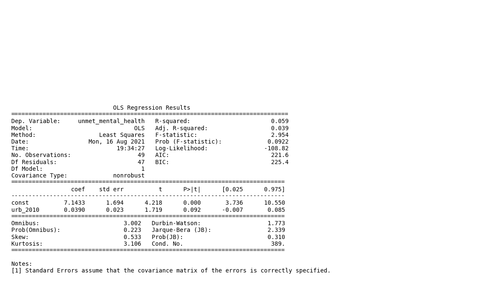

# Covid Socio-Economic Inquiry

A collection of various inquiries of of socio-economic indicators of a post-Covid
landscape.

Table of Contents:

1. Mental Health inquiry

## Mental Health Inquiry

This inquiry focus' on the change over time of mental health during Covid after
the initial panic shock subsided.

### Preliminary Notes

Data consists of U.S. mental health data which is sourced from data.gov and
tables on the state level consisting of the GINI coefficient,
poverty rate, and urbanization which is sourced from wikipedia. The script functions
as a mini end-to-end solution and will do the get requests, clean the data,
store the memized result in the  root/data/ folder in H5F5 format, before
returning the collections of charts used in the summary section.

### Summary

We begin by selecting "Needed Counseling or Therapy But Did Not Get It,
Last 4 Weeks" (renamed as unmet_mental_health) as our variable of interest.
Furthmore, we select 08/19/2020 as our start date and 06/23/2021 as end date to
compare the difference over time.

Fig.1 and Fig.2 is the result of testing for a statistically significant difference
in mental health over the time period. We use the confidence interval
of the begin date to see if the end date observed value lies within it.

__

### Fig.1: U.S. states with improvement in mental health

Interestingly only 3 states saw a marked improvement in mental health over the
time period.

__

### Fig.2: U.S. states with a deteoration in mental health

On the other hand there were a long list of states that saw a significant
deteoration in unmet mental health needs during the span of COVID. Given mental
health is strongly correlated with a person's overall wellbeing, it is prudent
that these states look into addressing the issues.

__

### Fig.3: Correlation Matrix

Looking at the linear correlation matrix we see that income inequality
of states has no measurable linear impact on unmet mental needs, but that poverty
levels and urbanization may have an impact. This inuition is reinforced by
poverty and urbanization having a negative correlation on each other
yet both having a positive correlation on unmet mental health.

__

### Fig 4: Mono Multi-Linear Model

Even though the model has statistically significant p-values, given the matrix
is ill conditioned due to urb_2010 varible we will decompose the linear model.

__

### Fig 5: Decomposed Multi-Linear Model

Looking at the p-values we see that none of our explanatory variables have a
statistically significant result at the 5% level, and hence we cannot claim that
the gini coef, poverty rate, or  urbanization has a casual impact on unmet
mental health needs. However, given that the mono model does have statistically
significant results and urbanization is significant at the 10% level it does
warrant further investigation.

### Sources

- "https://catalog.data.gov/dataset/mental-health-care-in-the-last-4-weeks"
- "https://en.wikipedia.org/wiki/List_of_U.S._states_by_Gini_coefficient"
- "https://en.wikipedia.org/wiki/List_of_U.S._states_and_territories_by_poverty_rate"
- "https://en.wikipedia.org/wiki/Urbanization_in_the_United_States"
